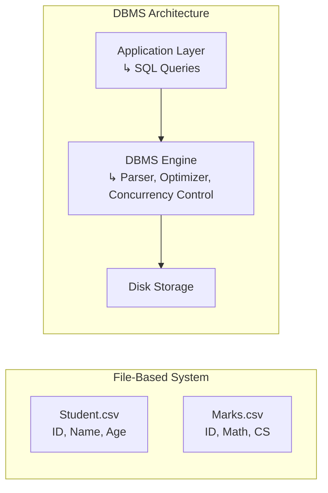

# 📂 Chapter 1.2: File System vs DBMS

---



## 🔍 Understanding the Shift

To truly appreciate the power and necessity of a Database Management System (DBMS), we must first understand what came before it — traditional file-based systems.

In early software systems, data was often stored in **flat files** — such as `.txt`, `.csv`, or `.json` — managed manually by programs. Each application had to handle how the data was read, written, and interpreted. There was no standardized way to store or retrieve data, and every function — from updating a record to searching across multiple files — had to be custom coded.

While this might work for small, single-user applications, it breaks down quickly when:
- The **volume of data grows**
- **Multiple users** need access simultaneously
- There’s a need for **secure, reliable, and consistent** data

Let’s explore this through a practical example.

---


#### 🧪 A Practical Scenario

So, as we questioned in the previous section justifying the need of DBMS, following it, imagine you’re running a small school. You decide to keep student records in `.csv` files — one for student details, another for marks.

### 📁 File-Based Approach

```csv
# student.csv
id,name,age
1,Raj,20
2,Priya,21

# marks.csv
id,math,cs
1,87,90
2,78,92
```

Now, let’s walk through the **core problems** this system creates.

### 1. Data Redundancy and Inconsistency

Suppose you keep multiple files for different purposes: student.csv, library.csv, fees.csv. All of them contain student names and IDs.

If a student’s name changes in one file but not others, you now have inconsistent data.
- Redundancy: Data repeated across files
- Inconsistency: Different files showing different infogi

##### DBMS solves this using normalization and relational integrity.
---

### 2. Difficulty in Accessing Data 

Now suppose you want to answer a seemingly simple question:

*“Get the names of students who scored more than 90 in Computer Science.”*

To achieve this using flat files, you’d need to:

- Write a script in Python or another language
- Read both files
- Match rows by student ID
- Filter by CS marks
- Extract and print names

It’s possible, but inefficient — especially as the dataset grows. Every query becomes a manual effort, with no structure to enforce rules, protect data, or optimize access.

Every new question = new code. No reuse, no abstraction.

---
### 3. Data Isolation
In File-based systems, related data is stored in different formats across files.

You may have :
- .csv for students
- .txt for attendance
- .json for hostel info

Joining or aggregating this data is sdifficult - there's no unified structure.

With DBMS :
- All data resides in tables
- Queries span multiple tables via joins
- You get logical abstraction over physical storage.

---
### 4. Integrity Problems
In a file-based system, nothing stops you from entering :
```csv
# marks.csv
id,math,cs
999,45,67 <--- But student 999 doesn't exist!
```
There's not automatic validation or relationship enforcement.

In a DBMS, you define constraints :
- Primary keys
- Foreign Keys
- Domain Checks (age>0)
- Not Null constraints
These rules preserve data integrity by design.
---
### 5. Atomicity Problems

Imagine teh following file-based operation :
- Student pays fees
- Hostel is assigned
- ID Card is generated

If the system crashes after step 2, your're stuck, you've made a partial update.

DBMS solves this with **transactions and atomicity** :
*All or nothing : either everything happens, or nothing does.*

---

### 6. Concurrent-Access Anomalies
if two admins edit the same file at once :
- One's update may overwrite the other's
- File corruption is possible
- No access control or locks


DBMS provides :
- isolation levels
- Locking Mechanisms
- Concurrency control

Which allow multiple users to work safely on the same data.

---

### 7. Security Problems
In file systems :
- You can restrict file access with OS permissions
- But there's no control over specific or actions

In DBMS :
- You can grant fine-grained privileges :
    - "read only access to marks"
    - "update acess to fees"
- You can define roles and users
- You can even track who changed what


---

### 🛠️ DBMS: The SQL Way
Now, with a DBMS, data is stored in structured tables, and operations are performed using declarative query languages — the most prominent of which is SQL (Structured Query Language).
Let’s revisit the same scenario, but this time using a DBMS like PostgreSQL.


```Sql
-- Table creation
CREATE TABLE students (
  id INT PRIMARY KEY,
  name VARCHAR(50),
  age INT
);

CREATE TABLE marks (
  id INT PRIMARY KEY,
  math INT,
  cs INT,
  FOREIGN KEY (id) REFERENCES students(id)
);

-- Data insertion
INSERT INTO students VALUES (1, 'Raj', 20), (2, 'Priya', 21);
INSERT INTO marks VALUES (1, 87, 90), (2, 78, 92);

-- Query to fetch students with CS > 90
SELECT name, cs FROM students
JOIN marks ON students.id = marks.id
WHERE cs > 90;
```

🔍 Output:
Priya | 92

As you can see, the query is expressive, concise, and doesn’t require writing procedural logic to parse or join files. This is the power of SQL — it allows you to describe what you want, and the DBMS figures out how to execute it efficiently.

### 🧠 But SQL Isn’t the Only Way

SQL is the most widely used language for querying relational databases, but it’s not the only one.

As you’ll discover in future chapters, databases can be:
- Relational (e.g., PostgreSQL, MySQL)
- Document-based (e.g., MongoDB)
- Key-value stores (e.g., Redis)
- Graph-based (e.g., Neo4j)

Each comes with its own data model, query language, and performance trade-offs. For example:
- MongoDB uses a JSON-like query syntax
- Neo4j uses a graph query language called Cypher

But no matter the database type or language, the principle remains the same: a DBMS abstracts the complexity of file operations and provides a consistent, structured way to manage, query, and evolve data.

A file system stores data.

A DBMS manages data — at scale, with structure, safety, and speed.

And as systems grow more complex, the ability to model, query, and control data through a DBMS becomes a foundational skill for every software engineer.


Now, let's move to the next section,  [1.3 Three-Tier Architecture](./1.3%20Three-Tier%20Architecture).
