## 📂 Chapter 1.3: The Three-Tier Architecture of DBMS

---

### 🚪 Why This Matters

Most people think of a database as a "thing you query". But in reality, a Database Management System (DBMS) is a **layered system** — designed to separate *what data is*, *how it's stored*, and *how users interact with it*. This separation is critical for:

- Scalability and modularity  
- Security and access control  
- Simplified system design and maintenance

---

### 🧱 What Are the Three Tiers?

The **three-tier architecture** consists of:

#### 🔹 1. External Level – View Layer
> What the user or application sees.

- Application interfaces, APIs, dashboards  
- User-specific views of the data  
- Provides **security**, **abstraction**, and **custom access**

#### 🔷 2. Conceptual Level – Logical Schema
> What the data *means*.

- Entire logical structure of the database  
- Tables, attributes, constraints, relationships  
- Independent of how data is stored physically

#### 🔸 3. Internal Level – Physical Storage
> How the data is actually stored.

- Data files, indexes, buffers, storage blocks  
- Optimized for space and performance  
- Closest to the hardware

---

### 🧭 Visualizing the 3-Tier Architecture

```mermaid
flowchart TB
    subgraph External_Level [🔹 External Level – View Layer <br>]
        A1[👤 User View -- App Interface, Dashboard]
        A2[🔌 APIs<br> REST / GraphQL / CLI]
    end

    subgraph Conceptual_Level [🔷 Conceptual Level – Logical Schema]
        B1[📄 Tables, Constraints, Relationships]
        B2[🔄 Business Rules / Data Model]
    end

    subgraph Internal_Level [🔸 Internal Level – Physical Storage]
        C1[🗂️ Data Files .db]
        C2[📦 Indexes -- B+ Trees, Hash]
        C3[🧠 Buffers / Disk Blocks]
    end

    A1 --> B1
    A2 --> B1
    B1 --> C1
    B1 --> C2
    B1 --> C3
```



---

### 🧩 Real-World Analogy

Imagine you're using a ride-hailing app like Uber:

| Tier             | Example in Uber                              |
|------------------|-----------------------------------------------|
| External Level   | You book a ride, track driver, rate trip     |
| Conceptual Level | System calculates distance, pricing, status  |
| Internal Level   | DB stores ride logs, payment, GPS data       |

You never interact directly with storage — that's abstracted away.

---

### ❓ Why 3 Tiers Only?

#### ❌ Why Not 2 Tiers?

Old systems often used 2 tiers:

```
[ Application ] ↔ [ Database ]
```

Problems:
- Tight coupling of logic + storage  
- Any DB change breaks the app  
- No user-specific views or security abstraction

---

#### ❌ Why Not 4 or 5 Tiers?

You *could* split further:
- Add caching layer  
- Add query optimizer  
- Add a sharding layer  

But these are **implementation-level**, not architectural concerns.  

Too many layers = overengineering  
Too few layers = underengineering

---

#### ✅ Why 3 Works Best

Each tier solves one fundamental problem:

| Layer           | Problem Solved                          |
|------------------|------------------------------------------|
| External Level   | What users/applications should see       |
| Conceptual Level | What data means + how it's structured    |
| Internal Level   | How to store & optimize the data         |

The 3-tier model hits the sweet spot:
- **Enough abstraction** to scale and secure  
- **Simple enough** to design and teach  

> 🎯 These are the only 3 architectural questions that matter — and each tier answers one.

---

### ✅ Benefits of 3-Tier DBMS

| Feature         | Why It Matters                                |
|------------------|-----------------------------------------------|
| Abstraction      | Hides storage and implementation complexity   |
| Modularity       | Change one layer without breaking others      |
| Security         | Restrict user access at the view level        |
| Scalability      | Each layer can scale independently            |
| Maintainability  | Easier to test, debug, and upgrade            |

---

### 🧠 Summary

- DBMS is designed using a **3-tier architecture**: External, Conceptual, Internal  
- This ensures **clear separation of concerns**, **data abstraction**, and **efficient management**  
- 2-tier is too rigid; 4/5-tier is unnecessarily complex  
- The 3-tier model is the **industry and academic standard** for a reason

---

📌 **Key Insight**:  
> A database is not just storage — it’s an abstraction of logic and structure,  
> layered to give users what they need, without exposing what they shouldn’t see.

---

➡️ **Next Up: Chapter 1.4 – Core Features of DBMS**  
Schemas, Data Independence, Transactions, and ACID properties coming next.
