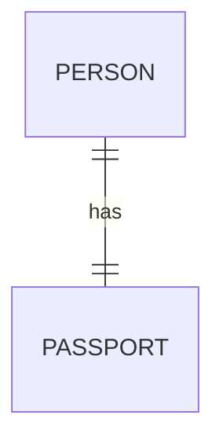
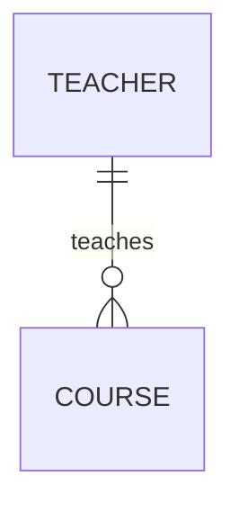
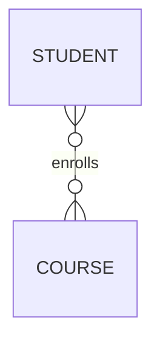

# 📘 2.4 – Cardinality and Participation

---

### 🧠 The Why

When you define a relationship between two entities, just saying "they’re connected" isn’t enough.

> You need to specify **how many** entities are involved and **how mandatory** that relationship is.

That’s where **Cardinality** and **Participation** come in — they define the **rules and constraints** that shape the data model.

---

### 🔗 Cardinality – "How Many?"

**Cardinality** specifies the number of entity instances that can be associated with another entity.

We generally classify relationships as:

| Cardinality | Meaning |
|-------------|---------|
| One-to-One (1:1) | A ↔ B (each has only one matching entity) |
| One-to-Many (1:N) | A → B (A can have many Bs, but each B has only one A) |
| Many-to-One (N:1) | Opposite of above |
| Many-to-Many (M:N) | A ↔↔ B (Both can have many) |

---

### 📐 Visual Examples

#### One-to-One



Each person has one passport, and each passport belongs to one person.

---

#### One-to-Many



A teacher can teach multiple courses, but each course is taught by only one teacher.

---

#### Many-to-Many



Students enroll in many courses, and courses have many students.

---

### 🧷 Participation – "Is It Mandatory?"

Participation tells you **whether every instance of an entity must participate** in a relationship.

#### Total Participation
- Every entity **must** be part of the relationship
- Represented by **double lines** in ER diagrams

📘 Example:
Every `Student` must have an `Enrollment`

```plaintext
STUDENT == enrolls ==> COURSE
```

#### Partial Participation
- Some entities **may** not be part of the relationship
- Represented by **single lines**

📘 Example:
Not every `Teacher` may have assigned `Courses` (e.g., new joiners)

```plaintext
TEACHER -- teaches --> COURSE
```

---

### 🎯 Real-World Analogies

| Relationship | Cardinality | Participation |
|--------------|-------------|---------------|
| Employee ↔ Aadhar | 1:1 | Total |
| Customer ↔ Orders | 1:N | Partial (not all customers place orders) |
| Student ↔ Courses | M:N | Total or Partial, based on system rule |

---

### 📏 How This Impacts Schema Design

- Dictates **foreign key placement**
- Determines **constraints** you’ll need
- Affects **query logic** and **data validation**

---

### ⚠️ Common Mistakes

| Mistake | Fix |
|--------|-----|
| Ignoring mandatory relationships | Decide if the participation is total or partial |
| Not distinguishing between 1:N and M:N | Clarify before designing schema |
| Thinking every M:N must be optional | Not always – some systems require full participation |

---

### ✅ Summary

- **Cardinality** defines *how many* entities participate in a relationship
- **Participation** defines *whether they must* participate
- These constraints help build **accurate and safe** data models
- Think of both when modeling real-world systems!

---

➡️ **Next:** [2.5 – Keys: Primary, Candidate, Super, Foreign](./2.5%20Keys.md)
